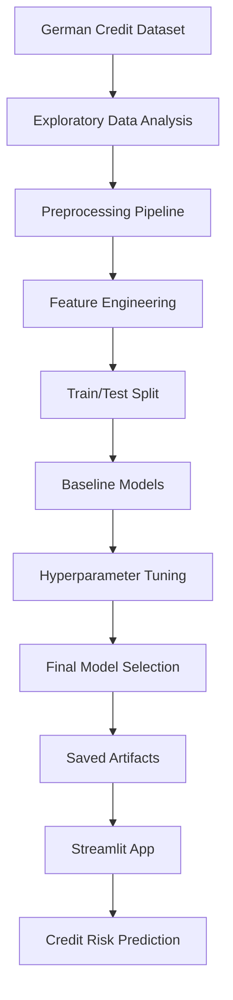

# 🏦 CodeAlpha Credit Scoring Model

**Production-Ready Machine Learning Pipeline with Explainability, Testing, CI/CD, and Interactive Streamlit Deployment**

> Educational and internship portfolio project for credit-risk classification using the German Credit Dataset. This repository is not production lending software and must not be used for real banking decisions.


## Repository Snapshot

| Item | Value |
|---|---:|
| Dataset | German Credit Dataset |
| Samples | 1,000 |
| Predictors after feature engineering | 25 |
| Models evaluated | 5 |
| Selected model | Random Forest Baseline |
| Accuracy | 75.5% |
| Macro F1 | 0.7173 |
| Best bad-class recall | SVM Baseline, 0.7833 |
| Deployment | Streamlit |
| Tests | 12 passed |

## Project Overview

Credit scoring estimates whether an applicant is likely to be a **good credit risk** or **bad credit risk** based on financial and demographic application attributes. This project turns the German Credit Dataset into a production-style machine learning workflow with reusable preprocessing, feature engineering, model evaluation, explainability, saved artifacts, automated tests, CI, and an interactive Streamlit app.

The final selected model is `random_forest_baseline`, chosen for the strongest balanced performance by macro F1. The `svm_baseline` model is documented as a business-risk alternative because it achieved the highest bad-class recall.

This is a professional portfolio and internship project. It is intended to demonstrate ML engineering, not to automate real credit decisions.

## Key Features

- Dataset ingestion and schema understanding
- Exploratory data analysis notebooks
- Reusable preprocessing and feature engineering modules
- Leakage-safe train/test workflow
- Baseline comparison across Logistic Regression, Decision Tree, Random Forest, SVM, and KNN
- Hyperparameter tuning for Random Forest and SVM
- Final model selection report and model card
- Random Forest feature-importance explainability
- Saved model and preprocessing artifacts
- Streamlit deployment app with example applicants and downloadable summaries
- Automated pytest coverage for validation, loading, paths, and prediction service behavior
- GitHub Actions CI workflow

## Architecture



## Repository Structure

```text
CodeAlpha_CreditScoringModel/
|-- app/                 # Streamlit app, inference services, schemas, path helpers
|-- src/                 # Reusable preprocessing, modeling, tuning, and explainability code
|-- notebooks/           # Phase-oriented EDA, preprocessing, training, tuning, and selection notebooks
|-- data/                # Raw, processed, and model-ready datasets
|-- models/              # Saved preprocessing, baseline, and tuned model artifacts
|-- reports/             # Model comparison, tuning, explainability, model card, final selection
|-- images/              # Generated charts and visual outputs
|-- docs/                # Deployment, testing, audit, release, and screenshot documentation
|-- tests/               # Automated pytest suite
|-- .github/             # GitHub Actions CI workflow
|-- requirements.txt
|-- README.md
`-- LICENSE
```

## Quick Start

```bash
git clone https://github.com/<your-username>/CodeAlpha_CreditScoringModel.git
cd CodeAlpha_CreditScoringModel
python -m venv .venv
.venv\Scripts\activate
pip install -r requirements.txt
streamlit run app/app.py
```

## Verification

```bash
python -m compileall app src
python -m app.smoke_test_inference
pytest
```

## Results

| Model Variant | Accuracy | Macro F1 | Recall Bad | ROC-AUC |
|---|---:|---:|---:|---:|
| `random_forest_baseline` | 0.7550 | 0.7173 | 0.6500 | 0.7907 |
| `svm_baseline` | 0.7300 | 0.7104 | 0.7833 | 0.7933 |
| `svm_tuned` | 0.7050 | 0.6845 | 0.7500 | 0.7754 |
| `random_forest_tuned` | 0.7150 | 0.6790 | 0.6333 | 0.7887 |

## Final Model Decision

The **Random Forest Baseline** was selected as the primary final model because it achieved the best overall balanced performance by macro F1 while retaining useful global explainability through feature importance.

The **SVM Baseline** remains documented as the risk-focused alternative because it achieved the strongest bad-class recall, which may be useful when the business priority is identifying more potentially risky applicants.

The tuned Random Forest and tuned SVM models were not selected because they did not outperform the baseline models on the final test comparison.

## Screenshots

Final screenshots are prepared through placeholder paths in `docs/screenshots/`. Capture them from the Streamlit app using built-in example applicants only.

| View | Path | Status |
|---|---|---|
| Home | `docs/screenshots/home.png` | Placeholder pending |
| Prediction Form | `docs/screenshots/prediction_form.png` | Placeholder pending |
| Prediction Result | `docs/screenshots/prediction_result.png` | Placeholder pending |
| Model Information | `docs/screenshots/model_information.png` | Placeholder pending |
| About Project | `docs/screenshots/about_project.png` | Placeholder pending |

## Demo GIF

Planned demo path: `docs/screenshots/demo.gif`

The GIF should show: open app → select example applicant → run prediction → view result card and probability bars.

## Documentation

- [Model Card](reports/model_card.md)
- [Final Model Selection Report](reports/final_model_selection/final_model_selection_report.md)
- [Deployment Guide](docs/DEPLOYMENT_GUIDE.md)
- [Testing Checklist](docs/TESTING_CHECKLIST.md)
- [Repository Audit](docs/REPOSITORY_AUDIT.md)

## Limitations

- Small historical dataset
- No fairness or bias audit
- No probability calibration
- No decision-threshold optimization
- No local per-applicant explanations such as SHAP or LIME
- Educational-only use
- Not production lending software

## Future Work

- Fairness and bias analysis
- Probability calibration
- Decision-threshold optimization
- Local model explanations
- Prediction monitoring and drift checks
- Cloud deployment
- Evaluation on newer and larger credit-risk datasets

## Author

**Syed Muzammil Shah**
